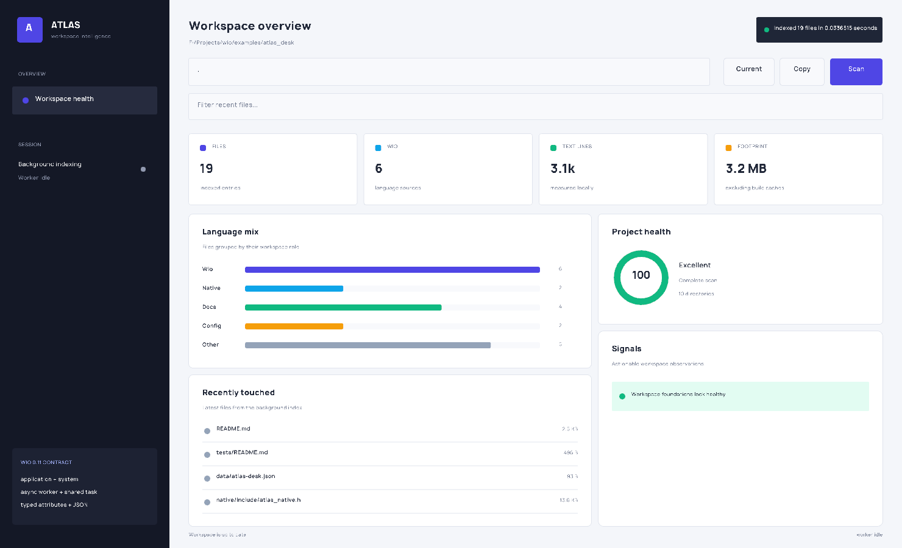

# Atlas Desk

Atlas Desk is a native workspace-intelligence desktop application written in
Wio 0.11. It indexes a local project without freezing the window, summarizes
the language mix and footprint, surfaces project-health signals, filters recent
files, and persists the last workspace between sessions.

This is intentionally a product-shaped validation project rather than a small
language demo.



## Wio 0.11 features exercised

- `application` owns the window lifecycle and orderly shutdown.
- `WorkspaceIndexer` is stack-resident `system` state with start/update/close
  handlers.
- `async fn`, `coroutine<string>`, `RunBlocking`, readiness checks,
  cancellation, and a shared task result keep indexing off the UI loop.
- User-defined typed attributes describe persisted and dashboard fields.
- Modern `using cpp::header(...)` and postfix `with native, cpp::name(...)`
  attributes define the raylib/native boundary.
- Component extensions calculate health labels, metrics, and filtered views.
- `Option`, `Result`, Result-pattern matching, exact JSON integers, and
  production JSON parsing/writing implement persistence and scanner transport.
- Unicode codepoint APIs power native text entry without an ad-hoc C++ string
  append bridge.
- Native `Color` and `Rectangle` POD components keep the drawing API typed.
- An opaque-backed `FontFace` object owns Manrope/raylib font handles.

## Build and run

From this directory with Wio 0.11 installed:

```powershell
wio project build --project . --configure
wio project run --project . --no-build
```

Or from the Wio repository root:

```powershell
build\app\Release\wio.exe project run --project .\examples\atlas_desk
```

Enter a directory and press Enter or **Scan**, choose **Current**, or drag a
folder into the window. The recent-file filter is Unicode-aware. **Copy** puts
a compact workspace summary on the clipboard.

## Smoke mode

The application provides a deterministic render/index/shutdown smoke mode:

```powershell
$env:WIO_ATLAS_SMOKE = "1"
wio project run --project . --no-build
Remove-Item Env:WIO_ATLAS_SMOKE
```

It waits for the async indexer, renders the populated dashboard, writes
`.wio-build/atlas-desk-smoke.png`, and exits through the application lifecycle.

## Native dependencies

The example carries a Windows x64 MinGW raylib static library so it builds with
the packaged Wio backend. Raylib uses the zlib license; Manrope uses the SIL
Open Font License. Their notices are in `LICENSES/`.

Generated builds and mutable `data/atlas-desk.json` preferences are ignored.
